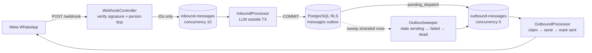
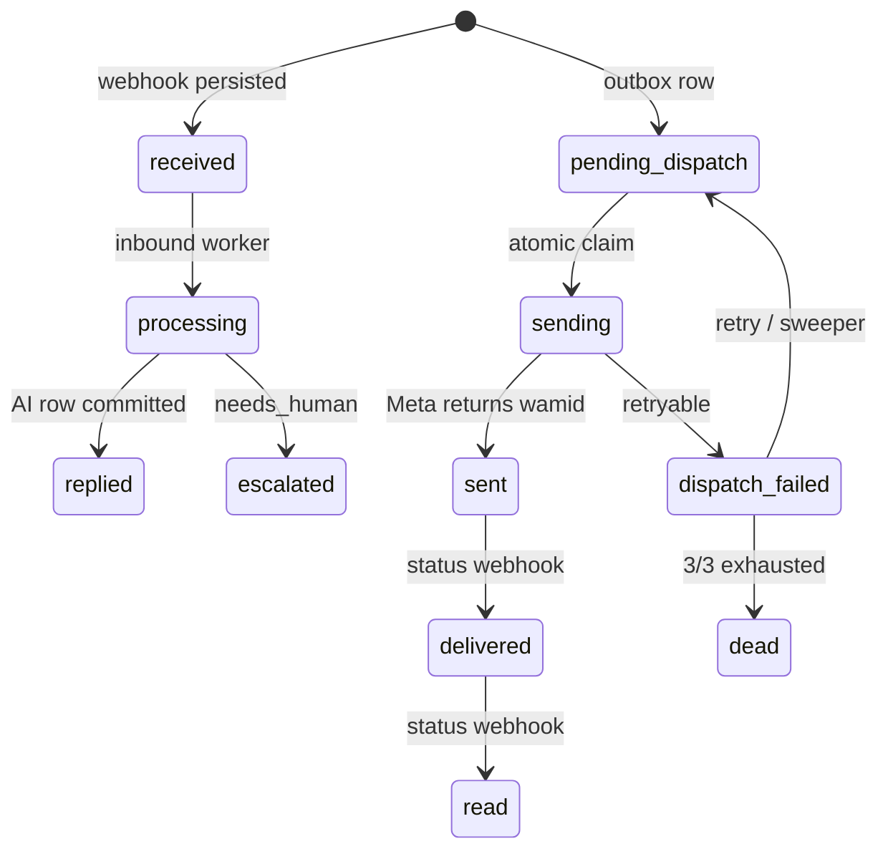

# AI Receptionist — Multi-Tenant WhatsApp Booking Agent

> NestJS modular monolith that answers WhatsApp messages with an AI receptionist, books appointments without double-booking, and escalates to humans when needed.

      

Built for one real use-case, done properly: **a dental clinic receives a WhatsApp message → AI answers from its own knowledge base → books / reschedules / cancels → sends reminders → hands off to staff on edge cases.** Multi-tenant from day one.

---

## 1. How it works



**The key guarantee:** the AI reply is `COMMIT`ted as `pending_dispatch` *before* the send job is enqueued. If Redis fails or the worker dies, the retry skips the LLM and just re-enqueues the send. No repeated `$` LLM calls, no lost replies.



## 2. The AI agent

Stateless LangGraph (`agent ↔ tools` loop) using `ChatGoogle gemini-3.6-flash`, temp `0`. History = last 20 PG messages. Tenant context passed via `configurable: { tenantId, conversationId, phoneNumber }`.

| Tool | What it does |
|---|---|
| `search_knowledge` | **Mandatory first step.** pgvector cosine search (`gemini-embedding-001`, 1536d, threshold `0.5`) over services / FAQs / doctor hours |
| `create_booking` | Validates hours + conflicts, picks a free doctor, suggests same-day + next-day alternatives |
| `update_booking` | Reschedules, keeps doctor if possible, rotates reminder jobs |
| `cancel_booking` | Cancels by ID or latest active, removes reminders |
| `escalate_to_human` | Last resort only — flips conversation to `needs_human` + holding message |

System prompt enforces: *never invent prices/hours, always relay tool results, never escalate on `UNAVAILABLE / NOT_FOUND`.*

## 3. Why bookings don't double-book

* Working-hours check (`doctor_hours` per weekday) + in-memory conflict check + **DB guard** (`P2002` / `23P01` exclusion violation → try next doctor).
* Reminders via `REMINDER_QUEUE`: delayed jobs at `start-24h` / `start-1h`, job IDs stored on `bookings`.
* Concurrency-safe conversations: `status (ai_active / needs_human / human_active)` + `version` optimistic locking. AI draft discarded if staff took over mid-LLM-run. Owner replies suppress stale AI sends and auto-resume to `ai_active` (CAS on version).

## 4. Multi-tenancy + reliability

| Concern | Implementation |
|---|---|
| Isolation | Postgres RLS via short `TenantTransaction.run()` (`set_config('app.current_tenant', $1, true)` — bound param, never interpolated) |
| Tenant resolution | `phone_number_id → tenantId` cached in Redis 24h |
| Idempotency | `UNIQUE(tenant_id, wa_message_id)` + `UNIQUE(reply_to_message_id)` + `jobId: inbound:${id} / send:${id}` |
| Outbound safety | Atomic `updateMany ... WHERE status IN (...)` claim, `dispatch_attempts < 3`, owner-ordering guard |
| WhatsApp client | Meta Graph `v21.0`, 10s timeout, retryable classifier (429/5xx/rate-limit yes, 190/131026/24h-window no) |
| Ops | Bull Board at `/admin/queues`, structured worker logs, outbox sweeper (5m lease expiry, 2m stranded collect) |

## 5. Stack & layout

**Stack:** NestJS 11 · PostgreSQL 16 + pgvector · Prisma 7 · Redis 7 + BullMQ 6 · LangChain + LangGraph · Gemini Flash + Embeddings · Meta WhatsApp Cloud API · JWT (15/30m access + 7d hashed refresh) · Jest + Supertest · Docker Compose (+ ngrok profile).

```
src/modules/
├── agent/         # LangGraph builder, node, 5 tools, AgentService
├── messaging/     # /webhook, MessagesService, inbound/outbound queues + sweeper
├── booking/       # BookingService, slot utils, reminder queue
├── conversations/ # inbox API, owner reply, ai/human status
├── knowledge-base/# sync / chunk / embed / verify (distance ≤ 0.5)
├── whatsapp/      # Cloud API client, signature auth, error taxonomy
├── tenantModule/  # signup / login / refresh, Redis tenant resolver
└── services|doctors|faqs/
common/            # prisma, tenant-transaction, redis, bullmq, llm, embedding
prisma/            # schema (tenants, messages outbox, bookings, kb vector)
docs/              # MESSAGE_QUEUE_ARCHITECTURE.md + specs/
```

## 6. Run it

```bash
docker compose up --build          # app :3000, postgres :5432, redis :6379
npx prisma migrate deploy
npm run start:dev
# queues:  http://localhost:3000/admin/queues
# webhook: POST /webhook (Meta calls root, excluded from /api versioning)
```

Required env: `DATABASE_URL · REDIS_HOST/PORT · GEMINI_API_KEY · META_GRAPH_VERSION · JWT_*_SECRET · WHATSAPP_VERIFY_TOKEN / APP_SECRET`.

## 7. API surface

| Area | Endpoints |
|---|---|
| Auth | `POST /api/v1/auth/signup · login · refresh` |
| Clinic data | CRUD `services · doctors · doctor-hours · faqs` + `POST knowledge-base/sync · verify` |
| Inbox | `GET conversations?status=&page= · GET conversations/:id · POST conversations/:id/reply {content, resumeAi} · PATCH conversations/:id/status` |
| WhatsApp | `GET /webhook` (verify) · `POST /webhook` (HMAC `X-Hub-Signature-256`, persist-first, 200 fast) |

Full collection: `postman/AI_Receptionist.postman_collection.json`.

## 8. Tests

```bash
npm test              # unit: booking.service, booking.tool, booking-slots, whatsapp.client
npm run test:e2e      # test/agent, test/conversations, test/messaging
npm run test:cov
```

Specs live next to code (`*.spec.ts`) + `docs/INBOUND_MESSAGES_TESTING_GUIDE.md`.
